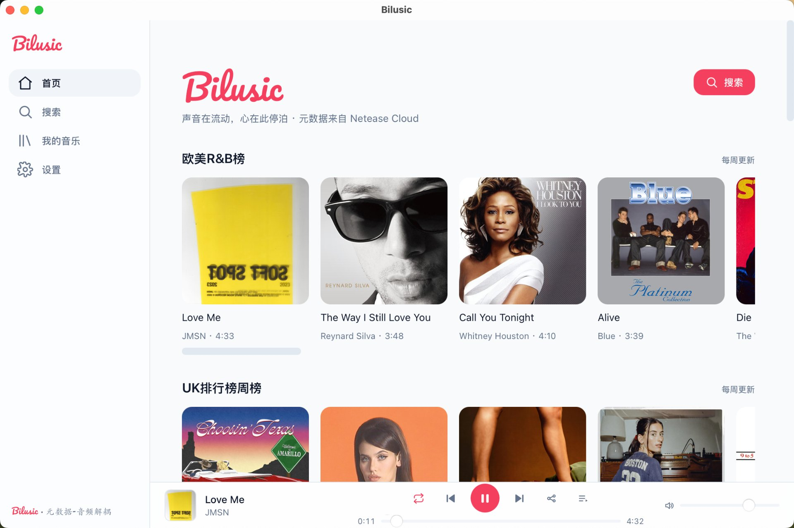

<p align="center">
  
</p>

<h1 align="center">Bilusic</h1>

<p align="center">
  一款轻量、开源的桌面音乐播放器。<br>
  通过<strong>可插拔的音频源</strong>接入多种音乐服务，跨平台（macOS / Windows / Linux）统一体验。
</p>

<p align="center">
  <a href="https://github.com/hyojooo/bilusic/releases/latest">
    
  </a>
  <a href="https://github.com/hyojooo/bilusic/releases">
    
  </a>
  <a href="./LICENSE">
    
  </a>
  
</p>

<p align="center">
  <a href="./README.md">English</a> · <strong>简体中文</strong>
</p>

<p align="center">
  
</p>

## ✨ 功能特性

- 🎵 **可插拔音频源** — 内置多套音源插件，可切换不同音乐服务作为播放后端。
- 🔌 **插件系统** — 支持声明式 / JS / WASM 三种插件形态，自由扩展元数据与音频引擎。
- 🌗 **深色 / 浅色主题** — 跟随系统或手动切换，界面自适应。
- 📜 **歌词与元数据** — 自动匹配歌曲信息与歌词，支持多语言界面。
- 🖥️ **跨平台原生体验** — 基于 Tauri 2（Rust + Web 前端），体积小、启动快。
- 🔎 **全局搜索** — 跨音源检索歌曲、专辑、歌单与艺人。

## 🚀 快速开始

### 开发

```bash
cd apps/desktop
pnpm install
pnpm tauri dev        # 启动桌面应用（同时拉起 Vite 开发服务器）
```

仅验证 Web 前端（无需 Rust 工具链）：

```bash
cd apps/desktop
pnpm install
pnpm dev              # 打开 http://localhost:1420
```

### 构建发行包

```bash
pnpm tauri build      # 产出 .dmg / .msi / .AppImage
```

> Windows 需安装 [WebView2](https://developer.microsoft.com/microsoft-edge/webview2/)；
> Linux 需 `libwebkit2gtk-4.1-dev` 等系统依赖（详见 CI 工作流）。

## 🧱 技术栈

Tauri 2（Rust） + React 18 + TypeScript + Vite + Tailwind CSS + Zustand · 包管理 **pnpm**

## 📁 项目结构

```
bilusic/
├── apps/desktop/            # Tauri 主项目（前端 + Rust 后端）
└── docs/                    # 规划、设计文档与截图
```

## 📄 许可证

基于 [MIT License](./LICENSE) 开源许可。

## ⚠️ 免责声明

本项目仅供**个人学习与研究**使用。请遵守你所接入的各音乐服务的服务条款，不得将本软件用于任何商业用途或侵犯第三方权益的行为。项目不内置、不托管任何受版权保护的内容，所有音频流均来自用户自行配置的音频源。
